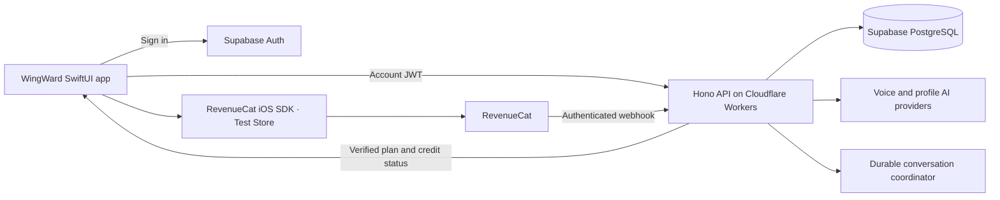

# WingWard — Developer guide

To evaluate the app, start with the [judge’s guide](../README.md). This page covers source code, automated checks, and optional self-hosting.

## Source layout and architecture



| Path | Contents |
| --- | --- |
| `apps/ios` | SwiftUI app, native voice transport, RevenueCat SDK integration, unit tests, UI tests |
| `apps/api` | Hono routes, authorization, AI services, Workers entrypoint, Durable Objects, API tests |
| `supabase/migrations` | Database schema, RLS, atomic application functions, billing and judging boundaries |
| `supabase/tests` | Database authorization and transaction tests |

The app uses Supabase for authentication and PostgreSQL, Hono on Cloudflare Workers for the API, OpenAI Realtime for the native voice transport, Mistral for profile and matching analysis, and RevenueCat for purchases. Existing provider adapters remain available in the source; provider credentials stay on the server.

## Run checks

Install the pinned dependencies without changing the lockfile:

```sh
mise install
pnpm install --frozen-lockfile
pnpm build
pnpm test
pnpm lint
```

The API's test configuration disables environment-file loading and uses test doubles for provider calls. These tests do not require live AI credentials. Keep the supplied package and action versions; do not update them just to run the judging build.

Run the native tests on a simulator installed on your Mac:

```sh
xcodebuild test \
  -project apps/ios/Wingward.xcodeproj \
  -scheme Wingward \
  -destination 'platform=iOS Simulator,name=iPhone 16,OS=latest' \
  -derivedDataPath /tmp/WingWardTestDerivedData \
  ONLY_ACTIVE_ARCH=YES ARCHS=arm64
```

Change the simulator name if that model is not installed. The existing CI runs build and API tests, secret and security scanning, and simulator XCTest when iOS files change. The iOS-change detector also runs native tests on the initial single-commit import.

## Use your own API and database

This section is optional. The judging app described in the [judge’s guide](../README.md) already points to the hosted environment.

1. Install Node.js 22 and pnpm 10.34.5, then run `pnpm install --frozen-lockfile`. Install the Supabase CLI and Docker for a local database, or create your own Supabase project. Use the Wrangler version pinned by `apps/api/package.json`.
2. From the repository root, run `supabase start` and `supabase db reset` to create a local database and apply the migrations. For a hosted project, use `supabase link --project-ref YOUR_PROJECT_REF` and `supabase db push` after reviewing all migrations. Run database tests only against a disposable local database.
3. Copy `apps/api/.env.example` to `apps/api/.dev.vars` for `wrangler dev`, and replace its placeholders with the configuration for **your** services. Keep the file untracked. Server-only credentials include the Supabase service-role key, AI provider keys, internal API token, and RevenueCat webhook secrets; never put those in an iOS configuration.
4. Run `pnpm --filter @repo/api dev:worker`. If you deploy your own Worker, review `wrangler.toml`, provision its Durable Object bindings, configure server secrets with `wrangler secret put`, and review the access gates before deployment. Judging access is fail-closed unless explicitly configured and backed by admitted accounts in the database.
5. Copy `apps/ios/Config/Local.xcconfig.example` to `apps/ios/Config/Local.xcconfig`. Set your API URL, Supabase URL and public client key, and RevenueCat **public** SDK key. Never put a service-role key, AI key, webhook secret, or account password here.
6. If you enable Test Store, create the two product identifiers above, associate the Premium product with its entitlement, and place both packages in the current Offering. Configure the authenticated webhook endpoint at `YOUR_API_URL/api/webhooks/revenuecat`; its server configuration must match the verification implemented by this API.

Native Realtime credential issuance for ordinary accounts is currently closed until a server-owned voice lease exists. Designated judging accounts use the bounded server-controlled voice path; copying the source does not admit an ordinary account.

The `.env.example` lists placeholders only. Unset sensitive integrations fail closed. Review every gate before enabling a provider or registering accounts in your own deployment; copying the source does not grant access to the hosted judging environment.

